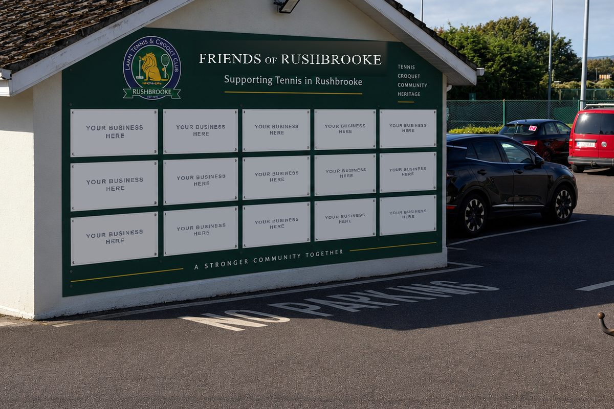

# rushbrooke-partners

The Season 2027 partnership site for Rushbrooke Lawn Tennis & Croquet Club.

One page. Plain HTML, CSS and JavaScript — no build step, no framework, nothing to
install. Every change can be made from GitHub's website, including on a phone.

---

## The one file you'll actually edit

**`assets/js/config.js`**

Prices, availability, benefits, contact details and the draft banner all live in that
one file, with plain-English comments beside each. To change something:

1. Open the repo on github.com and click `assets` → `js` → `config.js`
2. Click the pencil icon (top right)
3. Change the value — keep the quote marks and the comma at the end of the line
4. Scroll down, click **Commit changes**

The site updates itself a minute or two later.

**After a sale**, find the tier in `annualTiers` and change `sold: 0` to `sold: 1`.
The card's "5 of 5 remaining", the row of dots and the enquiry dropdown all follow
automatically.

---

## Before this goes live

Four things, in the order they'll probably clear:

1. **VAT.** Every price on the site is labelled "exclusive of VAT". Until the
   accountant confirms the treatment in writing, leave `draftNotice: true` in
   `config.js` and don't share the link publicly.
2. **Tournament pricing.** The three tournament prices in `config.js` are the ones
   from the prospectus draft. The Commercial Programme Architecture note (§2) says
   the figures that went to Committee are different. There's a long comment above
   that section spelling out both. Pick one and edit the numbers.
3. **Your phone number.** `contact.phone` is `null`, so no phone line shows. Set it
   when you've decided which number to publish.
4. **Remove the noindex tag.** In `index.html`, near the top, delete the line
   `<meta name="robots" content="noindex, nofollow">`. Until that's gone, Google
   will not list the site. Then set `draftNotice: false`.

---

## Putting it on the internet

This is already done. The site lives in **`Luc1oN/RLTCC`** and is served by GitHub
Pages from the `main` branch, root folder, at:

**https://luc1on.github.io/RLTCC/**

To update it: edit a file on github.com, commit, and the site rebuilds itself in a
minute or two. Nothing else to run.

It is up but deliberately **not discoverable**: `index.html` still carries a `noindex`
tag and the page still shows the draft bar, so search engines skip it and anyone who
opens it can see it is not final. Both come off together when VAT is confirmed — see
"Before this goes live" above.

### Custom subdomain — do this second, not first

The domain is parked in **`CNAME.txt`** rather than `CNAME`, on purpose. If a file
called exactly `CNAME` is present before the DNS record exists, GitHub redirects the
working `github.io` address to a domain that doesn't resolve yet, and the site appears
broken. So: set up DNS first, then rename the file.

Wherever `rushbrooketennis.com` is managed, add one DNS record:

| Type  | Name       | Value                    |
|-------|------------|--------------------------|
| CNAME | `partners` | `luc1on.github.io.` |

Once that record has spread (usually minutes, sometimes a few hours), rename
`CNAME.txt` to `CNAME` in this repo, then in Settings → Pages put
`partners.rushbrooketennis.com` in **Custom domain** and tick **Enforce HTTPS** once
the certificate has issued. Then change the `og:image` line near the top of
`index.html` to the new domain, so link previews keep working.

Leave the main WordPress site alone — just add a link to
`partners.rushbrooketennis.com` from its menu.

---

## The enquiry form

Out of the box, pressing **Send enquiry** opens the prospect's own email app with the
whole enquiry already written out, addressed to you. That works on GitHub Pages with
no account and nothing to set up.

If you'd rather enquiries arrived in your inbox without the prospect having to press
send twice: create a free form at [formspree.io](https://formspree.io), copy its
address, and paste it into `formEndpoint` in `config.js`. Nothing else changes.

---

## The imagery, and what is real in it

Two of the pictures on the page are real photographs of the club: the hero (the courts
looking towards the clubhouse) and the court board close-up, which is that same
photograph with its lettering digitally removed so the live preview can draw on it.

The other four — the gable wall, the noticeboards, the hallway banners and the seating
plaque — are **concept mockups**. Nothing on that list has been built yet. Each one is
labelled "Concept mockup" on the page, and there is a line above the gallery saying so
in plain English, so nobody can mistake them for photographs of something that exists.

Every mockup arrived carrying real company logos (Deloitte, EY, Heineken, Kearys and
others) and invented business names. All of it has been removed. `tools/neutralise.py`
is the script that did it: it finds each plaque, cell, banner and panel, samples the
surface's own colour, and paints a "Your business here" placeholder back on in the
photograph's own perspective. It is kept in the repo as a record of exactly what was
changed, and can be re-run if a new mockup comes in:

```bash
python3 tools/neutralise.py
```

It reads only from the original mockups and writes only into `assets/img/`.

**Nothing else goes on this site**: no third-party logo, no invented company name, no
testimonial, no partner logo. An invented but plausible business name is as misleading
as a real one. The nine slots in the footer stay empty and say "Your business here"
until real partners have signed.

### Replacing a mockup with a real photograph

Once the wall is up, or the banners are printed, or you get a good shot of the
noticeboards during a tournament week, swapping one in is a two-line change. In
`index.html` each mockup looks like this:

```html
<figure class="tp__shot tp__shot--mock">
  
  <figcaption class="tp__badge tp__badge--mock">Concept mockup</figcaption>
</figure>
```

Upload the new photograph into `assets/img/`, change `src`, `width`, `height` and the
`alt` text — then **delete the `<figcaption>` line**, because it is no longer a mockup.
Keep photos under about 300 KB and roughly 3:2 (landscape); anything bigger and the
page gets slow on mobile data.

## What's in here

```
index.html                     the whole page
assets/css/styles.css          all the styling
assets/js/config.js            ← the file you edit
assets/js/main.js              the behaviour; no need to touch it
assets/img/hero-courts.jpg     real photo of the courts and clubhouse
assets/img/court-net-board.jpg the same view, with the net board wiped blank
assets/img/court-board-closeup.jpg  a still of the preview, for the gallery card
assets/img/wall.jpg            concept mockup — gable wall, branding removed
assets/img/noticeboards.jpg    concept mockup — noticeboards, branding removed
assets/img/interior-banners.jpg concept mockup — hallway banners, branding removed
assets/img/named-facilities.jpg concept mockup — seating plaque, branding removed
assets/img/crest-*.png         the crest, exported from the 2017 Illustrator source
tools/neutralise.py            the script that stripped the branding out of the mockups
CNAME.txt                      the custom subdomain, parked until DNS is set up
.nojekyll                      tells GitHub Pages not to process the files
```

### The net-board preview

The court photograph has had its lettering digitally removed, so the board underneath
is a blank green field. When someone types their business name, the page lays it out
in SVG and draws it onto that board: single colour, reversed out, centred within the
board's safe area, exactly as the production spec describes. Nothing is uploaded or
stored — it's drawn in the browser and gone when the page closes.

If you replace the photograph, the board's position is four numbers in `config.js`
under `netBoard.rect` (measured as percentages across and down the photo).

### Fonts

Headings use whatever heritage serif the reader's device already has — Iowan Old Style
on Apple devices, Georgia elsewhere. That's deliberate: no font downloads means the
page renders instantly on a phone on mobile data. To use a specific typeface instead,
add a `<link>` to it in `index.html` and change `--serif` at the top of `styles.css`.

---

## Possible later, not needed now

A genuinely live availability counter — shared across devices, updated the moment a
deal closes — would take a small Supabase table and about twenty lines of JavaScript,
using the same read-merge-write pattern as the other projects on this account. It's a
fast follow, not a v1 requirement: hand-editing `sold:` after each sale is honest,
instant, and can't break.
